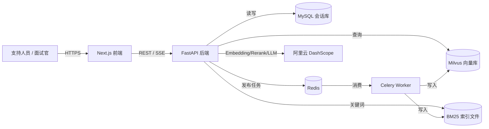
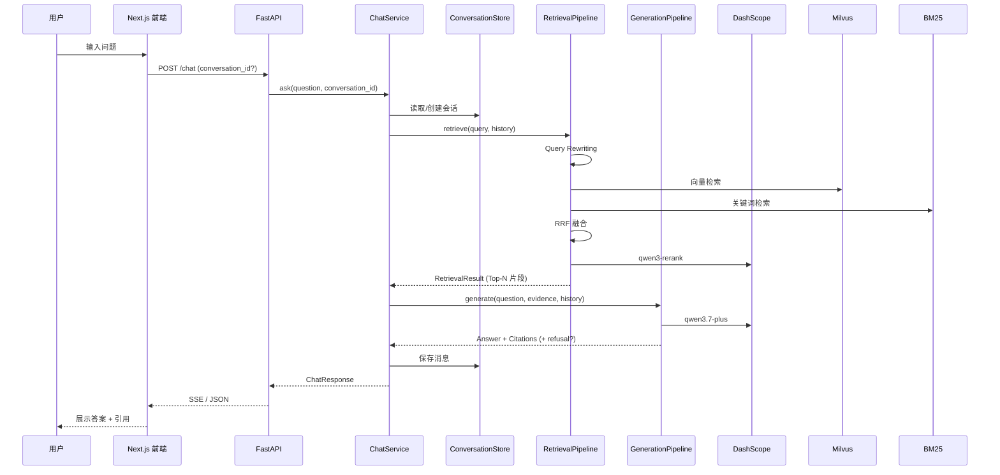
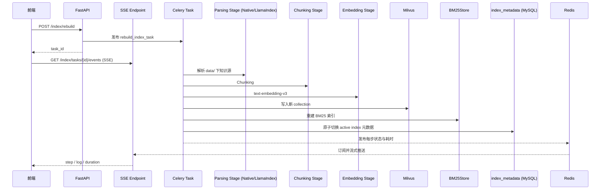

# Architecture Spine — CloudBrief 支持副驾

## Design Paradigm

**显式阶段管道（Pipes-and-Filters）+ 可插拔 Stage 适配器**

- 数据沿固定阶段单向流动：原始文档 → 切分 → 索引 → 检索 → 重排 → 生成 → 响应。
- 每个阶段有明确的输入/输出契约（Pydantic Model）。
- 同一 Stage 接口允许 Native 实现与 LangChain/LlamaIndex 适配器并存，用于对比与演进。
- 状态突变只发生在边界：Celery Worker 重建索引、MySQL 持久化会话、Milvus/BM25 更新索引。

## Invariants & Rules

### AD-1 — Pipeline 阶段契约

- **Binds:** `IndexingPipeline`, `RetrievalPipeline`, `GenerationPipeline`, 所有 Stage 实现
- **Prevents:** 阶段之间因隐式数据格式不一致导致集成失败；防止某个 Stage 直接依赖另一个 Stage 的内部状态
- **Rule:** 每个 Stage 必须实现 `AbstractStage.execute(input: TypedInput) -> TypedOutput`，输入输出必须是 `pydantic.BaseModel`。Stage 之间禁止共享可变对象，必须通过 DTO 传递。

### AD-2 — 检索证据是生成阶段的唯一上下文

- **Binds:** `RetrievalPipeline`, `GenerationPipeline`, `GenerationStage`
- **Prevents:** LLM 直接访问向量库或原始文档；防止生成阶段利用训练数据编造答案
- **Rule:** `GenerationPipeline` 只能接收 `RetrievalResult`（Top-N 片段列表）作为外部知识来源。生成模型不得直接接触 Milvus、BM25 索引或原始文件系统。

### AD-3 — 拒答在生成前硬分支

- **Binds:** `RerankStage`, `GenerationStage`, API 响应层
- **Prevents:** 基于低质量证据调用 LLM 生成，导致幻觉
- **Rule:** 当 `RerankStage` 输出的最高相关分低于阈值，或 Top-N 证据数量不足时，`GenerationPipeline` 必须返回 `RefusalResponse`，不得进入 LLM 生成分支。拒答阈值在配置中可调。

### AD-4 — 引用必须与生成答案一起返回

- **Binds:** `GenerationStage`, API 序列化层, Web 前端
- **Prevents:** 前端展示无出处答案；评测时无法验证引用
- **Rule:** 每个非拒答答案必须携带 `citations: List[Citation]`，每个 Citation 包含片段 ID、来源标题、更新时间、原文摘要。答案文本与 Citation 列表在同一响应对象中返回。

### AD-5 — 索引与查询服务解耦

- **Binds:** `IndexingPipeline` (Celery Worker), `RetrievalPipeline` (FastAPI 服务), `index_metadata` 表
- **Prevents:** 索引重建阻塞查询；查询服务直接写索引导致并发损坏；多版本索引共存时查询指向不确定
- **Rule:** 索引构建只在 Celery Worker 中执行，查询服务对索引只读。MySQL `index_metadata` 表记录当前 active collection 与 BM25 索引路径；新索引构建完成后在同一事务中把新记录置为 `is_active=true`、旧记录置为 `is_active=false`。查询服务启动时读取 active 记录并定期刷新；切换完成前继续使用旧索引。

### AD-6 — 会话状态由单一模块拥有

- **Binds:** `ConversationStore` (MySQL), Chat API, QueryRewritingStage
- **Prevents:** 多处直接读写会话表导致数据模型漂移
- **Rule:** 只有 `ConversationStore` 允许直接访问 `conversations` 和 `messages` 表。其他模块通过 `ConversationService` 的接口读取/追加消息。会话历史作为只读上下文传入 `QueryRewritingStage`。

### AD-7 — 外部模型调用统一封装

- **Binds:** Embedding Stage, Rerank Stage, Generation Stage
- **Prevents:** 各模块直接持有不同模型的客户端，导致密钥、重试、日志分散
- **Rule:** 所有外部模型调用必须通过 `ModelClient` 抽象（OpenAI-compatible HTTP + 重试/超时）。具体模型配置（base_url, model_name, api_key）集中在配置层，业务代码只依赖接口。

### AD-8 — 认证与鉴权统一在 API 层处理

- **Binds:** FastAPI 路由、`/auth/*`、`/admin/*`、依赖注入函数
- **Prevents:** 各业务路由自行实现鉴权导致不一致；未授权访问管理功能
- **Rule:** 所有需要保护的路由统一通过 FastAPI `Depends(get_current_user)` 注入当前用户；`get_current_user` 负责 JWT 校验、用户存在性检查、token 过期检查。角色校验通过 `Depends(require_role(...))` 实现。禁止在 Service/Store 层直接读取 token 或 session。

### AD-9 — 知识库目录/文件元数据与物理文件保持一致

- **Binds:** `KBDirectoryStore`、`KBFileStore`、文件上传/删除接口、`data/` 目录
- **Prevents:** 数据库记录与磁盘文件不一致；删除目录后残留文件或孤立元数据
- **Rule:** 创建目录时同时在 `data/` 下创建物理目录并写入 `kb_directories` 表；上传文件时先写入磁盘再写入 `kb_files` 表；删除文件时先删磁盘文件再删元数据；删除目录前校验为空。索引重建任务只读取 `data/` 下物理存在的文件，不直接依赖数据库文件表。

### AD-10 — 系统设置按"数据库 > .env > 代码默认值"优先级加载

- **Binds:** `Settings` 配置对象、`SystemSettingStore`、启动流程
- **Prevents:** 管理员在后台修改的设置重启后失效；业务代码读取到过时的 `.env` 值
- **Rule:** 应用启动时先加载 `.env` 和代码默认值，再从 `system_settings` 表中读取设置并覆盖内存中的对应字段。`SystemSettingStore` 是 `system_settings` 表的唯一访问入口。修改设置后通过刷新内存配置或重新加载使其生效。

| Concern | Convention |
| --- | --- |
| Naming | 模块/目录小写 + 下划线；Stage 类名以 `Stage` 结尾；Pipeline 类名以 `Pipeline` 结尾；DTO 用 Pydantic `*Input` / `*Output` / `*Result` 后缀。 |
| IDs | 片段 ID 使用 `{source_type}:{source_id}:{chunk_index}`；会话 ID 使用 UUID v4；任务 ID 使用 Celery 任务 ID；用户 ID 使用自增整数。 |
| Roles | 用户角色枚举为 `admin`、`qa`、`user`，禁止自定义角色。 |
| Passwords | 密码使用 bcrypt 哈希，禁止明文存储、禁止日志输出。 |
| Directory paths | 知识库根目录为 `data/`；子目录物理路径与数据库 `kb_directories.path` 保持一致；路径拼接使用 `pathlib.Path`。 |
| Dates | 元信息中更新时间使用 ISO 8601 UTC（`datetime.utcnow().isoformat()`）；业务展示时转本地时区。 |
| Error shapes | API 统一返回 `{ "error": { "code": "ERROR_CODE", "message": "...", "detail": {} } }`；Celery 任务失败时记录异常 traceback。 |
| Config | 所有环境相关配置通过 Pydantic Settings 从 `.env` 加载；运行期可覆盖配置通过 `system_settings` 表管理；不允许硬编码密钥、URL、模型名。 |
| Logging | 结构化日志（JSON）输出到 stdout；每个请求携带 `request_id`；模型调用记录 latency 和 token 用量。 |

## Stack

| Name | Version / Identifier | Role |
| --- | --- | --- |
| Python | 3.11+ | 后端语言 |
| FastAPI | ^0.111+ | HTTP API 框架 |
| Celery | ^5.3+ | 异步任务队列 |
| Redis | 7.x | Celery Broker / Backend |
| MySQL | 8.x | 会话持久化 |
| Milvus | 2.3.x | 向量检索存储 |
| BM25 | `rank-bm25` | 关键词检索 |
| Embedding | `text-embedding-v3` (DashScope) | 文本向量生成 |
| Reranker | `qwen3-rerank` (默认 0.6B) | 候选片段重排 |
| LLM | `qwen3.7-plus` (DashScope) | 主生成模型 |
| LLM (local fallback) | vLLM / Ollama + Qwen3 开源版 | 本地开源 LLM 备选（Phase 1）|
| Frontend | Next.js 14 + React + `@llamaindex/ui` | Web 聊天界面与管理后台 |
| Auth | `python-jose[cryptography]` + `passlib[bcrypt]` | JWT 签发与密码哈希 |
| Docker Compose | - | 本地依赖编排 |

## Structural Seed

### 系统上下文



### 后端模块结构

```text
backend/
  app/
    main.py              # FastAPI 应用入口
    config.py            # Pydantic Settings
    api/
      chat.py            # POST /chat, GET /chat/{id}
      index.py           # POST /index/rebuild, GET /index/tasks/{id}
      eval.py            # GET /eval/results, GET /eval/results/{id}, feedback
      health.py          # 健康检查
      auth.py            # POST /auth/register, /auth/login, /auth/logout, /auth/me
      admin/
        __init__.py      # Admin 路由聚合
        dashboard.py     # GET /admin/dashboard
        users.py         # GET/POST/DELETE /admin/users
        settings.py      # GET/PUT /admin/settings
        kb.py            # 知识库目录与文件管理
    pipelines/
      indexing.py        # IndexingPipeline
      retrieval.py       # RetrievalPipeline
      generation.py      # GenerationPipeline
    stages/
      base.py            # AbstractStage, DTOs
      parsing.py         # Native 知识源解析 Stage
      chunking.py        # 切分 Stage
      embedding.py       # Native Embedding Stage
      vector_retrieval.py# Milvus 向量检索 Stage
      bm25.py            # BM25 索引 / 检索 Stage
      hybrid_fusion.py   # RRF 融合 Stage
      reranking.py       # qwen3-rerank Stage
      query_rewrite.py   # 多轮查询改写 Stage
      generation_llm.py  # qwen3.7-plus 生成 Stage
      citation_parser.py # 答案引用解析 Stage
      adapters/          # LangChain / LlamaIndex 适配器
        lc_retrieval.py
        lc_generation.py
        li_parsing.py    # LlamaIndex parser 双路径
    stores/
      milvus.py          # Milvus 客户端封装
      bm25_store.py      # BM25 索引读写
      conversation.py    # MySQL 会话仓库
      eval_results.py    # RAGAS 评测结果仓库
      user.py            # 用户仓库
      kb_directory.py    # 知识库目录元数据仓库
      kb_file.py         # 知识库文件元数据仓库
      system_setting.py  # 系统设置仓库
    models/
      schemas.py         # Pydantic DTOs
    services/
      chat_service.py    # 编排 Chat 流程
      index_service.py   # 编排索引任务
      auth_service.py    # 认证服务
      admin_dashboard.py # Dashboard 聚合服务
      kb_service.py      # 知识库管理服务
    tasks/
      indexing.py        # Celery 索引任务
    clients/
      model_client.py    # 统一模型 HTTP 客户端
  eval/
    eval_set.json        # 评测集
    run_eval.py          # 评测脚本
    metrics.py           # 指标计算
  data/                  # 合成知识库样例
  docker-compose.yml     # Milvus + Redis + MySQL
  pyproject.toml
```

#### 持久化表（MySQL）

| 表名 | 作用 |
| --- | --- |
| `users` | 用户账号：用户名、密码哈希、角色、创建时间 |
| `conversations` | 会话元数据 |
| `messages` | 历史消息（含引用 JSON、拒答标记） |
| `index_metadata` | 当前 active collection / BM25 路径，用于原子切换 |
| `kb_directories` | 知识库目录元数据：名称、物理路径、父目录 |
| `kb_files` | 知识库文件元数据：文件名、目录 ID、来源类型、物理路径、更新时间 |
| `system_settings` | 运行期可覆盖的系统设置（拒答阈值、时效阈值等） |
| `eval_results` | RAGAS 评测过程数据、推理过程与人工反馈 |

### 核心数据流：提问



### 核心数据流：重建索引



## Capability → Architecture Map

| PRD Capability | Lives in | Governed by |
| --- | --- | --- |
| FR-1 知识源导入 | `tasks/indexing.py` + `data/` + `stages/parsing.py` | AD-5 |
| LlamaIndex 解析双路径 | `stages/adapters/li_parsing.py` | AD-1 |
| FR-2 文本切分 | `stages/chunking.py` | AD-1 |
| FR-3 异步索引构建 | `tasks/indexing.py` + Celery + `stores/` | AD-1, AD-5 |
| SSE 索引进度 | `tasks/indexing.py` + `services/index_service.py` | AD-5 |
| FR-4 双路检索 | `stages/vector_retrieval.py` + `stages/bm25_retrieval.py` | AD-1, AD-2 |
| FR-5 融合排序 | `stages/hybrid_fusion.py` | AD-1 |
| FR-6 Reranker | `stages/reranking.py` + `clients/model_client.py` | AD-1, AD-7 |
| FR-7 带引用生成 | `stages/generation_llm.py` + `stages/citation_parser.py` | AD-2, AD-4 |
| FR-8 诚实拒答 | `pipelines/generation.py` + `stages/reranking.py` | AD-3 |
| FR-9 时效提示 | `stages/generation_llm.py` | AD-4 |
| FR-10 会话上下文 | `stores/conversation.py` + MySQL | AD-6 |
| FR-11 查询改写 | `stages/query_rewrite.py` | AD-1, AD-6 |
| FR-12–14 评测 + RAGAS 审计 | `eval/` + `frontend/app/eval/` | AD-4 |
| FR-15–19 Web 界面 | `frontend/` (Next.js) | AD-4, AD-5 |
| FR-20 注册/登录/登出 | `api/auth.py` + `services/auth_service.py` + `stores/user.py` | AD-8 |
| FR-21 Dashboard | `api/admin/dashboard.py` + `services/admin_dashboard.py` | AD-8 |
| FR-22 用户管理 | `api/admin/users.py` + `stores/user.py` | AD-8 |
| FR-23 系统设置 | `api/admin/settings.py` + `stores/system_setting.py` + `config.py` | AD-10 |
| FR-24 聊天助手入口 | `frontend/app/admin/chat/page.tsx` | AD-8 |
| FR-25 知识库目录管理 | `api/admin/kb.py` + `stores/kb_directory.py` + `data/` | AD-9 |
| FR-26 知识库文件管理 | `api/admin/kb.py` + `stores/kb_file.py` + `tasks/indexing.py` | AD-5, AD-9 |
| FR-27 RAGAS 评测审计 | `api/admin/eval.py` + `frontend/app/admin/eval/` + `stores/eval_results.py` | AD-8 |

## Deferred

以下决策按三期路线图处理。Phase 1 为 MVP 必须交付；Phase 2/3 为演进方向，本 spine 为其预留边界但不固定实现细节。

### Phase 1（MVP，本次实现）

- **自研 Native Stage 主路径**：`pipelines/` + `stages/` 根目录实现。
- **LangChain/LlamaIndex 适配器完整实现**：`stages/adapters/` 下实现与 Native Stage 同接口的替代方案，用于对比与面试讲解。
- **LlamaIndex parser 双路径**：`stages/parsing.py` 提供 Native 解析器，`stages/adapters/li_parsing.py` 提供 LlamaIndex `SimpleDirectoryReader` 适配，两者输出统一 `Document` DTO。
- **本地开源 LLM Fallback**：通过 `ModelClient` 抽象支持切换至 vLLM / Ollama 托管的本地模型（如 Qwen3 开源版），作为 qwen3.7-plus 的可插拔备选。
- **拒答阈值可配置**：已在 `config.py` 中暴露，具体数值在评测阶段调优。
- **SSE 实时索引进度**：Celery Worker 每步完成后向 Redis 发布事件，FastAPI SSE 端点实时推送到前端，包含步骤名称、状态、耗时、日志摘要。
- **RAGAS 评测审计**：评测过程数据（contexts、scores、reasoning）写入 `eval_results` 表，管理后台可查看详情并人工反馈。
- **Admin 管理后台**：JWT 认证（注册/登录/登出）、Dashboard、用户管理、系统设置、知识库目录/文件管理、RAGAS 评测审计页。前端路由 `/admin/*`，复用现有 Chat 组件作为"聊天助手"入口。

### Phase 2（进阶）

- **索引增量更新**：监听知识源变更（文件哈希 / 更新时间），只更新新增/修改/删除的片段，避免全量重建。

### Phase 3（可选/架构预留）

- **多实例部署与负载均衡**：状态外置（Milvus/MySQL/Redis 已支持多实例共享），FastAPI 服务可水平扩展。本阶段只保留设计空间，不强制实现。
- **详细前端组件设计**：由开发阶段根据 `@llamaindex/ui` 具体 API 决定。
