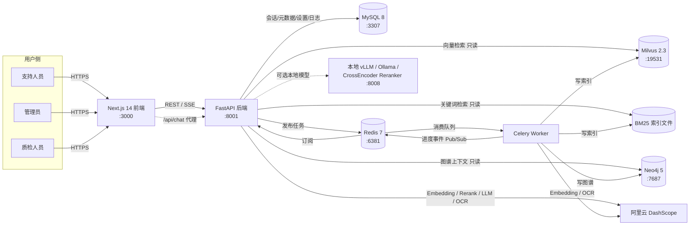
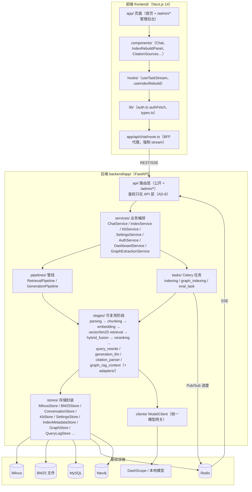
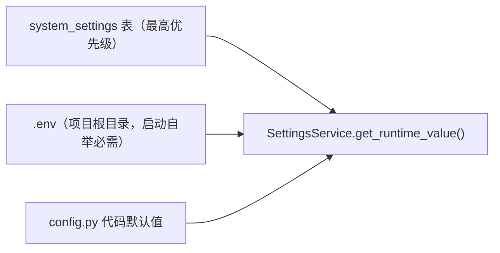
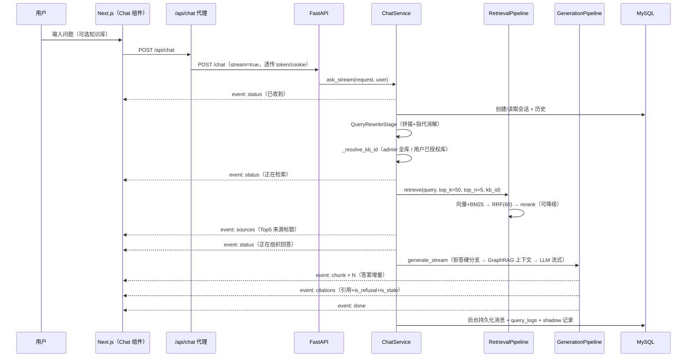

# CloudBrief 支持副驾 —— 技术架构文档

| 项目 | 说明 |
| --- | --- |
| 系统名称 | CloudBrief 支持副驾（knowledgeAgents） |
| 定位 | 面向企业内部的 Enterprise RAG 知识问答系统，作品集案例 |
| 文档版本 | v1.0 |
| 生成日期 | 2026-07-16 |
| 依据来源 | 仓库代码（backend/、frontend/、reranker/、docker-compose.yml）、`_bmad-output/planning-artifacts/`（PRD、Architecture Spine）、`_bmad-output/project-context.md` |
| 配套文档 | [业务流程文档](./business-processes.md) |

---

## 1. 架构概述

### 1.1 系统定位

CloudBrief 支持副驾是一个嵌入内部支持工作台的 AI 问答助手。支持人员用自然语言提问，系统在四类内部知识源（帮助文档、产品更新日志、历史工单、内部 FAQ）上做**混合检索**，由大模型生成**带引用**的答案；证据不足时**诚实拒答**而非编造，证据陈旧时给出**时效提示**。系统在 RAG 最难的三件事——溯源引用、诚实拒答、答案时效——上做了正面、可评测的工程实现。

### 1.2 设计范式

**显式阶段管道（Pipes-and-Filters）+ 可插拔 Stage 适配器**：

- 数据沿固定阶段单向流动：原始文档 → 解析 → 切分 → 索引 → 检索 → 融合 → 重排 → 生成 → 响应。
- 每个阶段（Stage）有明确的输入/输出契约（Pydantic DTO），实现统一的 `AbstractStage[InputT, OutputT]` 接口。
- 同一 Stage 接口允许 Native 实现与 LangChain / LlamaIndex 适配器并存，运行期可切换，用于对比与演进。
- 状态突变只发生在边界：Celery Worker 写索引、MySQL 持久化会话、Neo4j 写图谱；查询路径对索引只读。

### 1.3 架构约束（Invariants）

以下十条规则是系统的"骨架"，任何改动不得违反：

| 编号 | 规则 | 核心内容 |
| --- | --- | --- |
| AD-1 | Pipeline 阶段契约 | 每个 Stage 实现 `AbstractStage.execute(TypedInput) -> TypedOutput`，输入输出必须是 Pydantic Model，Stage 之间禁止共享可变对象 |
| AD-2 | 检索证据是生成的唯一上下文 | `GenerationPipeline` 只能接收 `RetrievalResult` 作为外部知识来源，LLM 禁止直接接触 Milvus / BM25 / 原始文件 |
| AD-3 | 拒答在生成前硬分支 | `max_score < refusal_threshold`（默认 0.3）或无召回时直接返回拒答，不进入 LLM 分支 |
| AD-4 | 引用必须与答案一起返回 | 非拒答答案必须携带 `citations: List[Citation]`（片段 ID、来源标题、更新时间、摘要） |
| AD-5 | 索引与查询服务解耦 | 索引写入只发生在 Celery Worker；查询服务只读；活跃索引切换走 `IndexMetadataStore.switch_active`（Redis 分布式锁保护）原子完成 |
| AD-6 | 会话状态单一模块拥有 | 只有 `ConversationStore` 直接访问 `conversations` / `messages` 表 |
| AD-7 | 外部模型调用统一封装 | 所有模型调用必须通过 `ModelClient`（OpenAI-compatible HTTP + 重试/超时/日志），密钥集中在配置层 |
| AD-8 | 认证鉴权统一在 API 层 | 路由通过 `Depends(get_current_user)` / `require_role(...)` 鉴权，Service/Store 层禁止碰 token |
| AD-9 | 知识库元数据与物理文件一致 | 目录/文件的创建删除同时落盘并写库；索引重建只读取物理存在的文件 |
| AD-10 | 设置按"数据库 > .env > 默认值"加载 | `SystemSettingStore` 是 `system_settings` 表唯一入口，启动时 DB 值覆盖 .env |

---

## 2. 系统上下文与部署视图

### 2.1 系统上下文



### 2.2 部署单元

| 部署单元 | 形态 | 说明 |
| --- | --- | --- |
| 前端 | Next.js 14（App Router）开发/生产服务器 | 页面 + BFF 代理路由 |
| 后端 API | uvicorn 单进程（`app.main:app`，:8001） | 无状态，可水平扩展（状态全部外置） |
| Celery Worker | `celery -A app.celery_app worker -Q kb.index.rebuild,kb.index.single,kb.graph.rebuild` | 唯一索引写入方 |
| 本地 Reranker（可选） | Docker profile `reranker`，:8008 | sentence-transformers CrossEncoder，Cohere 兼容 `/rerank` |
| 基础设施 | docker compose | Milvus(etcd+MinIO) / Redis / MySQL / Neo4j |

所有基础设施端口均为**非标准本地端口**（避免冲突）：Milvus `19531`、Redis `6381`、MySQL `3307`、MinIO Console `9003`、后端 `8001`、本地 reranker `8008`、Neo4j `7687/7474`。

---

## 3. 技术栈

### 3.1 后端（`backend/`，uv 管理，Python ≥ 3.11）

| 类别 | 选型 | 说明 |
| --- | --- | --- |
| Web 框架 | FastAPI ≥ 0.111 + uvicorn[standard] | SSE 用 sse-starlette |
| 数据校验 | Pydantic v2 + pydantic-settings | 全链路 DTO |
| 异步任务 | Celery ≥ 5.3（Redis broker/backend） | 三个固定队列 |
| 关系库访问 | SQLAlchemy 2.0 + PyMySQL | 启动时 `create_all` 建表 |
| 向量库 | pymilvus ≥ 2.3（Milvus 2.3.x） | 每知识库独立 collection，版本化 |
| 稀疏检索 | rank-bm25 + jieba | 中文分词，索引持久化为 pkl 文件 |
| 图数据库 | neo4j ≥ 5.20（可选 extra `graphrag`） | GraphRAG 实体/关系存储 |
| 模型调用 | httpx（OpenAI-compatible）+ tenacity | 统一 `ModelClient` |
| 认证 | python-jose[cryptography] + bcrypt(<5.0.0，钉版) | JWT HS256 |
| 文档解析 | pypdf / pypdfium2 / python-docx / openpyxl / pillow / python-frontmatter | 支持 md/json/csv/txt/pdf/docx/xlsx + 扫描件 OCR |
| 评测 | ragas ≥ 0.1 | faithfulness / answer_relevance 等 |
| 可观测 | structlog + python-json-logger + prometheus_client | JSON 日志 + /metrics |
| 适配器（可选路径） | langchain ≥ 0.2（retrieval / generation）、llama-index ≥ 0.10（parsing） | 与 Native Stage 同接口 |

### 3.2 前端（`frontend/`，npm 管理）

| 类别 | 选型 |
| --- | --- |
| 框架 | Next.js ^14.2（App Router，非 15）+ React ^18.3 + TypeScript strict |
| 样式 | Tailwind CSS ^3.4 + CSS 语义化变量 + next-themes（明暗双主题） |
| 图标/可视化 | lucide-react、cytoscape（图谱 schema 可视化）、react-syntax-highlighter、@llamaindex/ui |
| 规范 | eslint-config-next；路径别名 `@/*`；交互组件必须 `'use client'` |

### 3.3 模型服务

| 用途 | 云端默认（DashScope） | 本地备选 |
| --- | --- | --- |
| LLM 生成 | qwen3.7-plus | vLLM / Ollama（如 Qwen2.5-7B-Instruct） |
| Embedding | text-embedding-v3（1536 维，单批上限 10 条） | bge-m3 等（维度需同步改 `embedding_dim`） |
| Rerank | qwen3-rerank | 本地 CrossEncoder 服务（默认 BAAI/bge-reranker-large） |
| OCR（扫描件 PDF） | qwen-vl-ocr-latest | 无 |

Provider 语义：`llm_provider=dashscope` 时保留到本地的失败降级；`=local` 时为权威路径，**不回退云端**（避免私有化数据外发）。

---

## 4. 总体分层架构



分层依赖规则：上层只依赖下层接口；Stage 之间只通过 DTO 传递；`stores/` 是唯一的存储访问点；`clients/model_client.py` 是唯一的模型访问点。

---

## 5. 后端模块详解

### 5.1 目录结构（实际代码）

```text
backend/
  app/
    main.py               # FastAPI 入口：lifespan（建表、Neo4j 连接）、中间件、路由聚合、全局异常
    config.py             # Pydantic Settings，.env 唯一加载入口（lru_cache 单例）
    celery_app.py         # Celery 实例 + 队列路由
    dependencies.py       # get_current_user / get_current_user_optional / require_role
    logging_config.py     # structlog JSON + RequestIdMiddleware
    metrics.py            # Prometheus 指标定义
    api/
      chat.py             # POST /chat（SSE 流式）、会话历史/列表/改标题
      index.py            # POST /index/rebuild、任务状态、SSE 事件流
      auth.py             # register / login / logout / me
      eval.py             # 公开评测查询与反馈
      kb_access.py        # 知识库可见列表、访问申请
      health.py、metrics.py
      admin/              # /admin/*：dashboard、users、settings、kb、eval
    services/             # 业务编排层（全 async）
    pipelines/            # retrieval.py、generation.py
    stages/               # 各 Stage + adapters/（lc_retrieval、lc_generation、li_parsing、reranker_adapter）
    stores/               # 存储封装层
    clients/model_client.py
    tasks/                # indexing.py、graph_indexing.py、eval_task.py
    models/               # schemas.py（全部接口 DTO）、graph_schemas.py
  eval/                   # eval_set.json、run_eval.py、metrics.py、历史报告
  tests/                  # pytest（asyncio_mode=auto，外部依赖全 mock）
  data/                   # 知识库文件（合成样例 + data/kb/dir_{id}/ 上传文件）
```

### 5.2 API 路由清单

**公开/用户接口**

| 方法 | 路径 | 鉴权 | 说明 |
| --- | --- | --- | --- |
| POST | `/chat` | 可选（匿名可问） | 问答主入口；`stream=true` 时返回 SSE |
| GET | `/chat/{conversation_id}` | 可选 | 会话历史 |
| GET | `/conversations` | 登录 | 当前用户会话列表 |
| PATCH | `/conversations/{id}` | 登录 | 修改会话标题 |
| POST | `/auth/register` `/auth/login` `/auth/logout` | 开放 | 注册/登录（JWT 同时写 Cookie）/登出 |
| GET | `/auth/me` | 登录 | 当前用户 |
| GET | `/kb-access/accessible` | 登录 | 我可见的知识库列表 |
| POST | `/kb-access/requests`、GET `/kb-access/requests/mine` | 登录 | 知识库访问申请与查询 |
| GET | `/eval/results` 等 | 开放 | 评测结果查询与反馈 |
| GET | `/health`、`/metrics`、`/metrics/models` | 开放 | 健康检查、Prometheus 指标、模型可用性 |
| POST | `/index/rebuild`、GET `/index/tasks/{id}`、`/index/tasks/{id}/events` | admin | 全量重建 + SSE 进度 |

**管理接口（`/admin/*`，由 `admin_router` 聚合）**

| 模块 | 路径 | 角色 | 说明 |
| --- | --- | --- | --- |
| dashboard | `GET /admin/dashboard`（+ `/stats` `/eval-scores` `/recent-tasks` `/graph-rag` `/system-health`） | admin, qa, user | 聚合概览（拆分为 6 个子接口并行加载） |
| users | `GET/POST/DELETE /admin/users[/{id}]` | admin | 用户管理，禁止删除最后一个 admin |
| settings | `GET/PUT /admin/settings`、`GET /admin/settings/{key}/runtime`、`POST /admin/settings/{key}/reset` | admin | 运行期设置读写，secret 字段掩码（/runtime 查询接口登录即可读） |
| kb | `GET/POST/DELETE /admin/kb/directories[…]`、`/admin/kb/files[…]`、`POST /admin/kb/files/{id}/index`、`POST /admin/kb/rebuild` | admin | 目录树、文件上传/删除、单文件索引、整库重建 |
| kb graph | `GET/PUT /admin/kb/{id}/graph-schema`、`POST …/graph-schema/recommend`、`POST …/graph/rebuild`、`GET …/graph/shadow-reports` | admin | GraphRAG schema 配置、LLM 推荐、图索引重建、shadow 对比报告 |
| kb access | `GET /admin/kb/access-requests`、`POST /admin/kb/access-requests/{id}/review` | admin | 访问申请审批 |
| eval | `GET /admin/eval/results[/{id}]`、`POST …/{id}/feedback`、`GET /admin/eval/export` | admin, qa | RAGAS 评测审计、人工复核、CSV/JSON 导出 |

### 5.3 Service 层（业务编排）

| Service | 职责 |
| --- | --- |
| `ChatService` | 问答全流程编排：会话创建 → 历史读取 → 查询改写 → kb 权限解析 → 检索 → 生成 → GraphRAG shadow 记录 → 持久化 → 查询日志 |
| `IndexService` | 触发 rebuild / 单文件 / 图索引任务；任务状态查询（Celery + MySQL 步骤表归一化）；SSE 事件流（先回放 MySQL 历史步骤，再订阅 Redis Pub/Sub） |
| `KbService` | 目录树、文件上传（先落盘后写库，`auto_index_on_upload` 时自动触发单文件索引）、删除、重建触发 |
| `SettingsService` | 运行期配置：注册表（SettingMeta：分组/类型/校验/secret/restart_required/requires_reindex）→ DB 快照缓存 → `get_runtime_value()` |
| `AuthService` | 注册/登录/JWT 签发与校验（bcrypt 密码哈希） |
| `DashboardService` | 管理后台聚合数据（用户/会话统计、索引状态、评测均分、最近任务、GraphRAG 状态、依赖健康） |
| `GraphExtractionService` | LLM 实体/关系抽取（按 schema 约束）、schema 推荐、实体归一化与合并 |

### 5.4 Pipeline 层

**RetrievalPipeline（`pipelines/retrieval.py`）**

1. 按 `retrieval_adapter` 选路：`langchain` → `LangChainRetrievalStage`；默认 `native` 走下列阶段链。
2. 读取活跃索引（`IndexMetadataStore.get_active(kb_id)`），无活跃索引直接报错 `No active index found`。
3. `VectorRetrievalStage`（Milvus，失败时记 WARN 并降级为仅 BM25，`is_fallback=True`）+ `BM25RetrievalStage`（jieba 分词）。
4. `HybridFusionStage`：**RRF，k=60 固定**，Top-K=50。
5. `RerankingStage`：经 `create_reranker_adapter` 按 `reranker_provider` 选 DashScope qwen3-rerank 或本地服务；**reranker 不可用时回退融合分数**（不硬失败）。
6. 输出 Top-N=5 + `is_fallback` 标记，全程记录 Prometheus 指标（延迟/召回数/rerank 最高分）。

**GenerationPipeline（`pipelines/generation.py`）**

1. **硬分支拒答**：`chunks` 为空，或（非 fallback 且 `max_score < refusal_threshold`）→ 直接返回固定拒答文案 + 诊断信息。fallback 时跳过阈值判断（RRF 分数与 rerank 分数不同尺度）。
2. **GraphRAG 上下文注入**：若该 kb 启用了图 schema，经 `GraphRAGContextStage` 做实体链接（LLM 抽取实体名 → Neo4j 子图查询 → 格式化为文本），带 `graphrag_timeout_seconds` 超时保护；失败仅记 WARN，不阻塞主流程。
3. `GenerationLLMStage`：系统提示词强制"只基于证据回答 + 论断级 `[^chunk_id]` 引用 + 不足即拒答 + 中文分点"；支持 `execute()` 与 `execute_stream()`；LLM 超时/不可用返回友好降级文案（非拒答、不引入幻觉风险）。
4. `CitationParserStage`：从答案中解析 `[^chunk_id]` 标记映射回检索片段，生成 `Citation` 列表并清洗正文。
5. **时效检查**：任一引用来源 `updated_at` 距今超过 `stale_threshold_days`（默认 90 天）→ `is_stale=true`。

### 5.5 Stage 层

| Stage | 类型 | 职责 |
| --- | --- | --- |
| `parsing.NativeParser` / `adapters/li_parsing` | 同步 CPU | 解析 md/json/csv/txt/pdf/docx/xlsx；PDF 页级心跳、页数上限 2000、扫描页 OCR（qwen-vl-ocr）；失败文件跳过并记录原因；`parser` 配置切换 LlamaIndex `SimpleDirectoryReader` 路径，输出统一 `Document` |
| `chunking.ChunkingStage` | 同步 CPU | 段落优先切分，默认 max 800 字符 / overlap 100 字符；生成 `chunk_id = {source_type}:{source_id}:{chunk_index}` |
| `embedding.EmbeddingStage` | 网络 I/O | 分批（≤10 条/批）调用 Embedding API，按批心跳；空内容 chunk 跳过并按 chunk_id 对齐 |
| `vector_retrieval` / `bm25_retrieval` | 同步 I/O | Milvus 向量 Top-K / BM25 稀疏 Top-K |
| `hybrid_fusion` | 同步 CPU | RRF(k=60) 融合去重排序 |
| `reranking` + `adapters/reranker_adapter` | 网络 I/O | provider 二选一；失败回退融合分数 |
| `query_rewrite` | 同步 CPU | 拼接最近历史 + 规则化指代消解，生成自包含检索查询（MVP 策略，可升级 LLM 改写） |
| `generation_llm` | 异步网络 I/O | 见 5.4 |
| `citation_parser` | 同步 CPU | 引用标记解析与正文清洗 |
| `graph_rag_context` | 异步 | 实体链接 → Neo4j 一跳子图 → 文本化上下文 |

同步/异步分工约定：CPU 型 Stage 用同步 `execute()`；涉及 LLM/网络 I/O 的用 `async execute()/execute_stream()`；Service 层全 async；同步 DB/存储调用在 async 路由/服务里用 `asyncio.to_thread` 包装。

### 5.6 Store 层与数据访问

| Store | 后端 | 职责 |
| --- | --- | --- |
| `MilvusStore` | Milvus | collection 创建（带 dim）、chunk+向量写入、向量检索、全量 chunk 读取（供图索引构建） |
| `BM25Store` | 文件（pkl） | 构建/保存/加载 BM25 索引，jieba 分词检索 |
| `ConversationStore` | MySQL | 会话与消息的唯一读写方（AD-6），标题/时间戳维护 |
| `KbStore` | MySQL + 文件系统 | `kb_directories` / `kb_files` 元数据，与 `data/kb/dir_{id}/` 物理结构一致（AD-9） |
| `IndexMetadataStore` | MySQL | 活跃索引查询、版本历史、`switch_active` 原子切换（同事务置新 active、旧 inactive） |
| `SettingsStore` | MySQL | `system_settings` 唯一入口（AD-10） |
| `IndexTaskStepStore` | MySQL | 任务步骤持久化（task_id+step_name 唯一），供 SSE 回放 |
| `QueryLogStore` | MySQL | 全量问答审计日志（含改写、分数、配置快照、分段耗时；user_id 哈希化） |
| `EvalResultsStore` | MySQL | RAGAS 评测结果与人工反馈 |
| `UserStore` | MySQL | 用户账号 |
| `KbAccessStore` | MySQL | 知识库级访问授权与申请审批 |
| `GraphStore` | Neo4j | 实体/关系 upsert（按 kb_id 隔离）、子图上下文查询、按文档删除、`is_available` 探活；挂 `app.state` 复用连接 |
| `GraphSchemaStore` / `GraphShadowStore` | MySQL | 图 schema 配置（per 顶层目录）、shadow 对比记录 |

### 5.7 ModelClient（统一模型网关）

- 内部按用途持有多个 `_ProviderClient`（llm / embedding / reranker / ocr），各自维护 base_url、密钥、超时、httpx 客户端。
- 能力：`embed`（同步，分批）、`chat`（异步，支持 stream）、`ocr_image`；调用日志记录 latency 与 token 用量；tenacity 重试。
- Provider 策略：dashscope 优先、失败可降级本地（LLM/Embedding）；`local` 为权威路径不回退云端。

### 5.8 Celery 任务（索引是唯一写入路径，AD-5）

队列路由固定：

| 任务 | 队列 | 流程 |
| --- | --- | --- |
| `rebuild_index_task(kb_id)` | `kb.index.rebuild` | parse → chunking → embedding →（Redis 锁内）write_milvus → build_bm25 → atomic_switch |
| `index_file_task(file_id)` | `kb.index.single` | 单文件 parse/chunk/embedding → **copy-on-write**：把现有活跃索引的 chunk 与新 chunk 合并写入新 collection+新 BM25 文件 → 原子切换 |
| `rebuild_graph_task(kb_id)` / `index_file_graph_task` | `kb.graph.rebuild` | 读取活跃索引 chunk → LLM 抽取实体/关系 → Neo4j upsert |
| 评测任务 | `eval_task.py` | RAGAS 离线评测 |

关键工程细节：

- **版本化命名**：collection 名 `{milvus_collection}_kb_{kb_id}_{timestamp}_{uuid8}`，BM25 文件同理；旧索引随切换自动失去 active。
- **原子切换**：`switch_active` 在 Redis 分布式锁 `index:active_switch_lock:{kb_id}`（timeout 3600s，blocking 300s）内执行，MySQL 单事务完成新旧记录的 active 翻转。
- **全灭保护**：解析为 0 文档或切分为 0 chunk 时中止任务，原活跃索引保持不变。
- **进度事件**：每步骤 `_publish_step` 双写——MySQL `index_task_steps`（持久化回放）+ Redis Pub/Sub 频道 `index:task:{task_id}`（实时）；高频进度用心跳节流（≥2s 间隔，末次必发）。
- 任务超时 `task_time_limit=3600`，`worker_prefetch_multiplier=1`（长任务公平调度）。

---

## 6. 数据架构

### 6.1 MySQL 表（12 张，启动 `create_all` 自动建）

| 表 | 用途 | 关键字段 |
| --- | --- | --- |
| `users` | 账号 | username 唯一、password_hash(bcrypt)、role(admin/qa/user) |
| `conversations` | 会话 | id(UUID v4)、user_id、title（首问前 16 字自动生成） |
| `messages` | 消息 | role、content、citations_json、is_refusal |
| `index_metadata` | 索引版本 | kb_id、collection_name、bm25_index_path、is_active、version、parent_id、reason、source_changes_json |
| `index_task_steps` | 任务步骤 | task_id+step_name 唯一、status、duration_ms、log（SSE 回放源） |
| `kb_directories` | 知识库目录树 | parent_id 自引用、name（顶层目录即一个知识库） |
| `kb_files` | 知识库文件 | directory_id、relative_path、status(uploaded/indexing/indexed/failed)、content_hash、last_task_id |
| `kb_user_access` | 库级授权 | kb_id、user_id、status(pending/approved/rejected) |
| `kb_graph_schemas` | 图 schema | directory_id 主键、enabled、shadow_mode、entity_types_json、relation_types_json、最近构建统计 |
| `graph_shadow_records` | shadow 对比 | kb_id、question、vector_answer、graph_answer、subgraph_context_json |
| `system_settings` | 运行期设置 | key 唯一、value、description、updated_by |
| `eval_results` | 评测 | question、contexts_json、answer、ground_truth、ragas_scores_json、reasoning_json、human_score/is_adopted/is_modified |
| `query_logs` | 问答审计 | log_hash 唯一、user_hash（脱敏）、原/改写问题、config_snapshot、retrieved_chunks、answer、分段延迟 |

### 6.2 Milvus 向量库

- 每个知识库、每次索引构建生成独立 collection：`{base}_kb_{kb_id}_{yyyMMdd_HHmmss}_{uuid8}`，向量维度随 `embedding_dim`（默认 1536）。
- 查询服务永远只读 `index_metadata` 中 `is_active=true` 的那一条对应的 collection。
- 历史 collection 不主动删除（版本可回溯，`list_history` 可查）。

### 6.3 BM25 文件索引

- rank-bm25 + jieba 分词，序列化为 pkl，与 collection 同名版本化，路径记录在 `index_metadata`。
- `BM25_INDEX_PATH` 仅作为目录锚点，实际文件带 kb_id 与时间戳。

### 6.4 Neo4j 图模型

- 节点 `Entity`（kb_id + 标准化名 + 类型唯一）、边 `Relation`（kb_id + 三元组唯一），均携带来源 chunk/doc ID 以支持按文档删除与溯源。
- schema 按知识库顶层目录配置（`kb_graph_schemas`）：实体类型、关系类型、enabled、shadow_mode。
- Neo4j 不可用时 `GraphStore.is_available=false`，主服务正常启动，GraphRAG 自动静默降级。

### 6.5 配置优先级与自举



- 启动期配置（连接串、端口、日志级别）在后台修改后标记 `restart_required`，重启生效；`mysql_url` 的 DB 覆盖通过一级自举读取（先按 .env 建临时连接读覆盖值，再建正式连接池）。
- 修改 Embedding 相关配置标记 `requires_reindex`，需重建索引生效。

---

## 7. 核心链路

### 7.1 问答链路（流式）



SSE 事件协议：`event: status|sources|chunk|citations|done|error`，`data: {json(ensure_ascii=False)}`；响应头固定 `Cache-Control: no-cache`、`X-Accel-Buffering: no`。非流式模式（`stream=false`）走 `ask()` 一次性返回 `ChatResponse`。

### 7.2 索引构建链路（全量重建）

```mermaid
sequenceDiagram
    participant AD as 管理员
    participant FE as 前端 IndexRebuildPanel
    participant API as FastAPI
    participant W as Celery Worker
    participant R as Redis
    participant DB as MySQL

    AD->>FE: 点击「重建索引」
    FE->>API: POST /index/rebuild（admin）
    API->>W: rebuild_index_task → 队列 kb.index.rebuild
    API-->>FE: task_id
    FE->>API: GET /index/tasks/{id}/events（SSE）+ 轮询兜底
    W->>W: parse → chunking → embedding（每步事件双写 MySQL + Pub/Sub）
    W->>R: 获取 index:active_switch_lock:{kb_id}
    W->>W: 写新 Milvus collection → 建新 BM25 文件
    W->>DB: switch_active 单事务切换
    W-->>R: task completed 事件
    R-->>API-->>FE: 逐步推送 step/status/duration_ms/log
```

单文件索引（`index_file_task`）流程相同，但写入阶段为 **copy-on-write 合并**：读取现活跃索引全部 chunk + 新文件 chunk → 写入全新 collection 与 BM25 文件 → 原子切换；旧索引在切换前持续服务，实现"增量更新零停机"。

### 7.3 GraphRAG 链路

1. 管理员在某顶层目录配置图 schema（手工或 `graph-schema/recommend` 由 LLM 基于样本推荐）。
2. 触发 `rebuild_graph_task`：从活跃 Milvus collection 读取该库全部 chunk → `GraphExtractionService` 按 schema 批量 LLM 抽取 → 归一化/合并 → Neo4j upsert。
3. 问答时：若 schema.enabled 且配置了类型，`GraphRAGContextStage` 用 LLM 从问题中链接实体 → Neo4j 一跳子图 → 文本化注入生成 prompt（超时/失败静默降级）。
4. **shadow_mode**：开启后系统后台用"向量证据 + 图谱上下文"再生成一份候选答案，与用户看到的向量答案一起落 `graph_shadow_records`，供后台对比评估，不影响线上答案。

---

## 8. 认证与安全

| 方面 | 实现 |
| --- | --- |
| 认证 | JWT HS256（默认 24h）；登录同时写 `access_token` HttpOnly Cookie |
| Token 读取顺序 | `Authorization: Bearer` → `access_token` Cookie → `?token=` query（兼容 SSE 无法自定义 Header） |
| 鉴权层级 | `get_current_user`（严格）/ `get_current_user_optional`（匿名兼容）/ `require_role("admin", ...)`；只在 API 层（AD-8） |
| 角色 | `admin` / `qa` / `user` 固定三角色；前端 `middleware.ts` 拦截 `/admin/*` 无 Cookie 跳转登录页 |
| 知识库级权限 | `kb_user_access`：admin 全库；普通用户仅 default + 已授权库；未授权访问返回 403 |
| 密码 | bcrypt 哈希（钉版 <5.0.0 保兼容），禁明文、禁入日志 |
| 密钥 | 只在 `.env`，经 `get_settings()`（SecretStr）注入；settings API 对 secret 字段掩码；禁硬编码/禁提交 |
| 审计脱敏 | `query_logs` 存 user_hash 而非明文 user_id |
| 错误形态 | 统一 `{error: {code, message, detail}}`；全局异常处理器兜底 500 |
| CORS | 仅放行 localhost:3000/3001，允许 credentials |

---

## 9. 可观测性

- **结构化日志**：structlog JSON 输出 stdout；每请求经 `RequestIdMiddleware` 注入 request_id；模型调用记录 latency/token；GraphRAG 有慢查询（>500ms）、鲜度（>7 天）、抽取量过低三类 WARN 阈值。
- **Prometheus 指标**（`GET /metrics`）：
  - HTTP：`http_requests_total`、`http_request_duration_ms`（按 method/path/status，仅核心接口）
  - 检索：`retrieval_latency_ms`、`recall_count`、`rerank_max_score`（labels: adapter/kb_id/fallback）
  - 生成：`generation_latency_ms`（provider/model）、`refusal_rate_total`（reason/kb_id）、`error_total`（code/component）
  - 任务：`index_task_total`（task_type/kb_id/status）；模型：`model_up`
- **业务审计**：`query_logs` 全量记录每次问答的原问题/改写/召回/答案/引用/配置快照/四段耗时（rewrite/retrieve/generate/total），支撑回放分析与面试讲解。
- **任务可追踪**：`index_task_steps` 持久化每个索引任务的步骤状态与耗时，SSE 断线可回放。

---

## 10. 评测体系

- 评测集 `backend/eval/eval_set.json`：覆盖可回答/不可回答/时效三类问题，标注期望要点与期望引用。
- `run_eval.py`：逐题跑完整问答链路 → RAGAS 计算 faithfulness / answer_relevance 等指标 → 结果（含 contexts、scores、reasoning）写 `eval_results` 表 + 本地 JSON 报告；输出 P50/P90/P95 延迟。
- 审计闭环：`/admin/eval` 页面（admin/qa）查看详情 → 人工评分 1-5 + 备注 + 是否采用/需修改 → CSV/JSON 导出。
- 目标基线（PRD SM）：检索命中率 ≥80%、引用准确率 ≥85%、拒答正确率 ≥80%、时效提示正确率 ≥80%、P90 ≤ 30s。

---

## 11. 前端架构

### 11.1 页面地图

| 路由 | 说明 |
| --- | --- |
| `/` | 首页：左 `IndexRebuildPanel`（索引重建 + 进度），右 `Chat`（问答主界面） |
| `/eval`、`/kb-access` | 公开评测查看、知识库访问申请 |
| `/admin/login`、`/admin/register` | 公开认证页 |
| `/admin/dashboard` | 概览（统计卡、索引状态、评测均分、最近任务、GraphRAG 状态、系统健康，6 卡并行加载） |
| `/admin/chat` | 聊天助手（复用 Chat 组件） |
| `/admin/kb` | 知识库管理（目录树/文件/上传/索引状态/重建）+ `/admin/kb/access` 访问授权审批 |
| `/admin/settings` | 系统设置（分组表单，secret 掩码，restart/reindex 提示） |
| `/admin/eval` | RAGAS 评测审计（列表/详情/人工复核/导出） |
| `/admin/users` | 用户管理 |

### 11.2 关键设计

- **BFF 代理**：浏览器不直连后端；`/api/chat`（route.ts）强制 `stream=true`、透传 Bearer/Cookie、以 SSE 转发后端流。
- **状态收敛在 hooks**：`useTaskStream`（SSE + 1.2s 轮询兜底混合，事件排序去重、终态停轮询）、`useIndexRebuild`（重建交互）；组件不自行管理 EventSource。
- **Chat 组件**：消费 `status/sources/chunk/citations/done/error` 事件；`status` 渲染为进度提示、`sources` 先展示来源、`chunk` 增量渲染、`citations` 渲染可点击引用 + 时效警告条；维护会话列表（新建/切换/改名）、知识库下拉（`/kb-access/accessible`）、AbortController 中断。
- **鉴权**：`lib/auth.ts` 的 `authFetch` 自动带 token/credentials；`middleware.ts` 保护 `/admin/*`。
- **主题**：next-themes + Tailwind 语义变量（`bg-card`/`text-card-foreground`/`dark:*`），所有 UI 明暗双主题，禁止写死颜色。
- **共享类型**：`lib/types.ts` 集中定义（Citation、ChatMessage、IndexTaskStatus、Dashboard*、KbAccess* 等），与后端 DTO 对齐。

---

## 12. 部署与运行

### 12.1 docker compose 服务

| 服务 | 镜像 | 端口 | 说明 |
| --- | --- | --- | --- |
| etcd | quay.io/coreos/etcd:v3.5.5 | 内部 | Milvus 元数据 |
| minio | minio RELEASE.2023-03-20 | 9002/9003(console) | Milvus 对象存储 |
| milvus-standalone | milvusdb/milvus:v2.3.21 | 19531 | 向量库 |
| redis | redis:7-alpine | 6381 | broker/backend/Pub-Sub/分布式锁（AOF 持久化） |
| mysql | mysql:8.0 | 3307 | 关系存储（库 cloudbrief） |
| neo4j | neo4j:5-community | 7687/7474 | GraphRAG（可选依赖） |
| vllm-reranker | ./reranker（自构建，FastAPI+CrossEncoder） | 127.0.0.1:8008 | `--profile reranker` 可选；模型权重持久化在 vllm_model_cache 卷 |

### 12.2 本地启动顺序

```bash
docker compose up -d                 # 基础设施
cp .env.example .env                 # 填入 LLM_API_KEY / EMBEDDING_API_KEY / RERANKER_API_KEY / OCR_API_KEY 等
cd backend && uv venv --python <python3.11> && uv sync
uv run uvicorn app.main:app --host 0.0.0.0 --port 8001 --reload
uv run celery -A app.celery_app worker -Q kb.index.rebuild,kb.index.single,kb.graph.rebuild --loglevel=info
cd frontend && npm install && npm run dev
```

首次问答前必须执行一次索引重建（前端按钮或 `POST /index/rebuild`），否则检索抛 `No active index found`。

### 12.3 质量门禁

- 后端：`uv run pytest`（asyncio_mode=auto，外部依赖全 mock）+ `uv run ruff check .`（line-length 100）
- 前端：`npm run lint`；无 CI，合并前本地必跑。
- 评测：`uv run python -m eval.run_eval`

---

## 13. 演进方向

| 方向 | 现状 | 预留/规划 |
| --- | --- | --- |
| GraphRAG | schema 配置/图索引/上下文注入/shadow 对比已落地 | shadow 评估达标后转为默认增强；融合进主答案策略 |
| Agentic RAG | 已有 SPEC（`_bmad-output/specs/spec-cloudbrief-agentic-rag`），未实现 | 工具调用、多步检索规划的演进路径已预留（Stage 可插拔） |
| 增量索引 | 单文件 copy-on-write 已支持"上传即索引" | 文件变更监听、删除同步、定时重建 |
| 多实例部署 | API 无状态、状态全外置 | 负载均衡、多 worker 扩展 |
| 权限体系 | 三角色 + 库级授权 | 用户组、细粒度 ACL（PRD 明确非 MVP 目标） |

---

## 附录 A：关键 ID 与常量约定

| 约定 | 值 |
| --- | --- |
| chunk_id | `{source_type}:{source_id}:{chunk_index}`（引用解析与增量索引依赖） |
| 会话 ID | UUID v4；任务 ID = Celery task id；用户 ID 自增 int |
| source_id（后台上传文件） | `kb/dir_{目录id}/{文件名}` |
| RRF 常数 | k=60（固定，勿在 Stage 内静默修改） |
| Top-K / Top-N | 召回 50 / 证据 5 |
| Embedding 批次 | ≤10 条（DashScope 上限） |
| 拒答阈值 | 0.3（运行期可调） |
| 时效阈值 | 90 天（运行期可调） |
| 时间元数据 | `datetime.utcnow().isoformat()`（ISO 8601 UTC） |
| 错误形态 | `{"error": {"code", "message", "detail"}}` |
