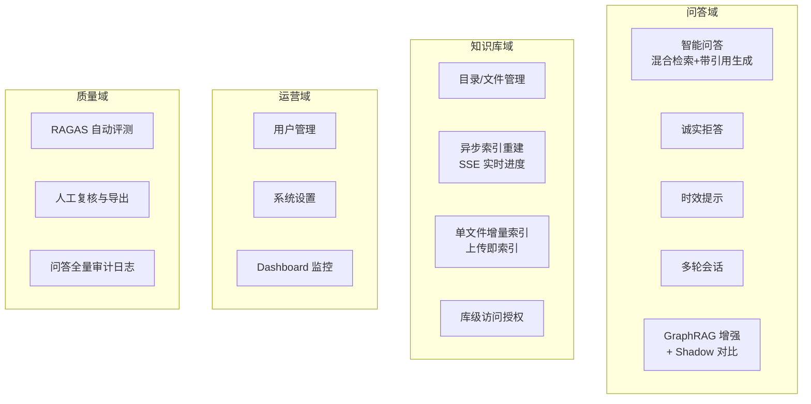
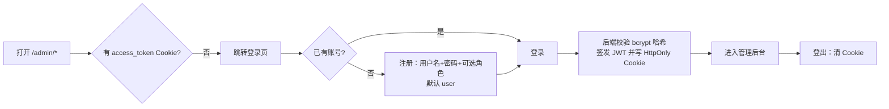
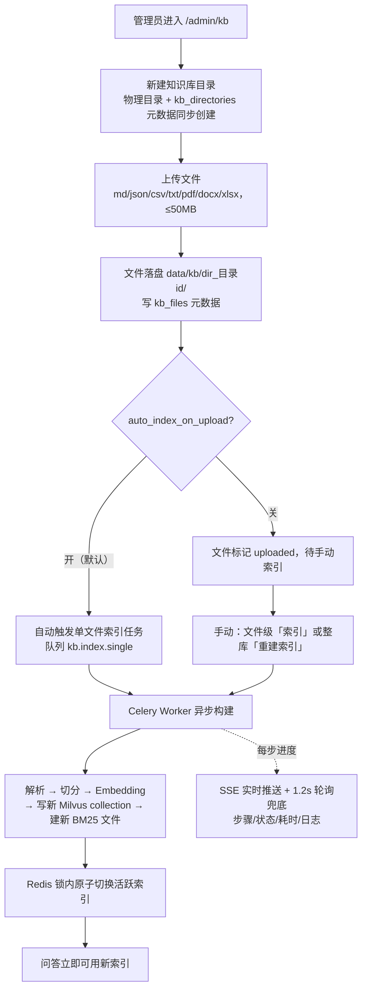
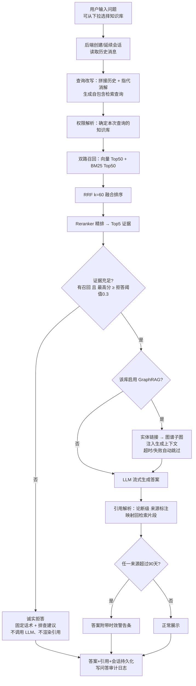
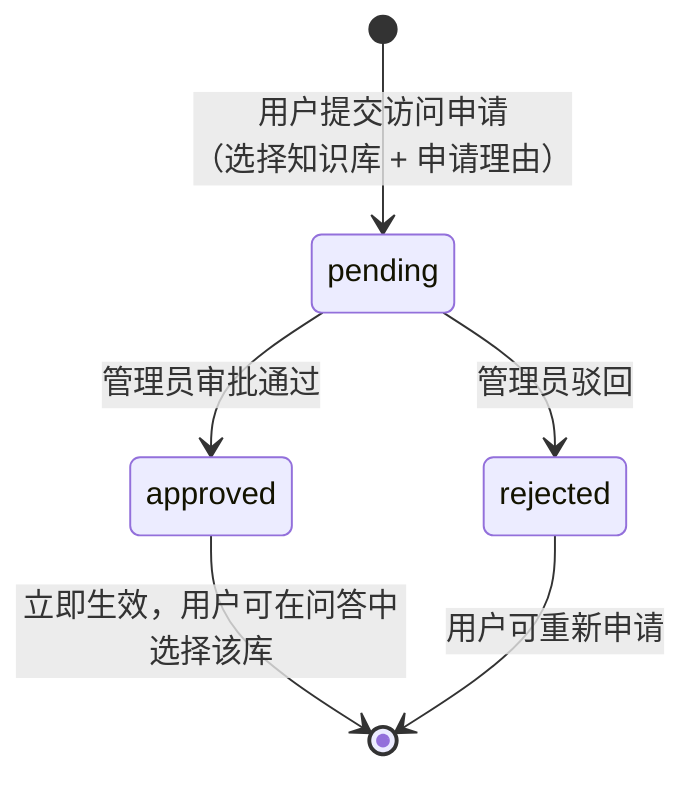
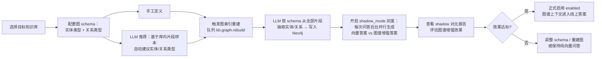
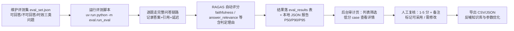

# CloudBrief 支持副驾 —— 业务流程文档

| 项目 | 说明 |
| --- | --- |
| 系统名称 | CloudBrief 支持副驾（knowledgeAgents） |
| 定位 | 面向企业内部支持团队的 RAG 知识问答助手（作品集案例） |
| 文档版本 | v1.0 |
| 生成日期 | 2026-07-16 |
| 依据来源 | PRD（`_bmad-output/planning-artifacts/prds/prd-knowledgeAgents-2026-07-01/prd.md`）+ 当前系统实际实现 |
| 配套文档 | [技术架构文档](./architecture.md) |

---

## 1. 产品概述

### 1.1 一句话定位

CloudBrief 支持副驾是嵌入内部支持工作台的 AI 问答助手：支持人员用自然语言提问，系统在内部知识库（帮助文档、产品更新日志、历史工单、内部 FAQ，以及管理员上传的各类文件）中检索证据，生成**带引用、可溯源**的答案；证据不足时**诚实拒答**，证据陈旧时**提示时效**。

### 1.2 业务价值

| 价值点 | 说明 |
| --- | --- |
| 快 | 几秒内给出答案，替代在多个系统间手工翻找 |
| 准 | 每个论断标注出处，支持人员点开核对后敢直接发给客户 |
| 诚实 | 检索不到证据就明说"找不到"，不编造答案误导一线 |
| 不过期 | 引用来源过旧时给出警告，避免把失效信息发给客户 |
| 可度量 | RAGAS 自动评测 + 人工复核闭环，质量用数据说话 |

### 1.3 角色

| 角色 | 系统标识 | 职责 |
| --- | --- | --- |
| 支持人员（普通用户） | `user` | 日常问答、多轮追问、申请知识库访问权限 |
| 质检人员（客服主管） | `qa` | 查看 RAGAS 评测结果、人工复核评分、导出标注 |
| 系统管理员 | `admin` | 用户管理、知识库搭建与索引、GraphRAG 配置、系统调参、访问审批、Dashboard 监控 |

系统同时允许**匿名访问**问答主界面（用于演示/作品集场景），匿名会话不绑定用户。

### 1.4 术语表

| 术语 | 定义 |
| --- | --- |
| 知识源 | 系统作答依据的内部资料：帮助文档、更新日志、历史工单、FAQ，以及后台上传的 md/json/csv/txt/pdf/docx/xlsx 文件 |
| 知识库（KB） | 知识库目录树的顶层目录；每个知识库拥有独立的向量/BM25/图索引，并可单独授权 |
| 片段（Chunk） | 知识源切分后的最小检索单元，引用指向的对象，带来源与更新时间 |
| 混合检索 | 向量语义检索 + BM25 关键词检索双路召回 |
| 融合排序 | RRF（k=60）把两路结果合并为一个候选列表 |
| 重排（Rerank） | reranker 模型对候选二次精排，输出 Top-5 证据 |
| 引用（Citation） | 答案论断到具体片段的溯源标注，可点击查看原文摘要 |
| 拒答（Refusal） | 证据不足时不调用 LLM，直接回复"找不到足够信息" |
| 时效提示（Stale） | 任一引用来源超过时效阈值（默认 90 天）时给出"来源较旧"提醒 |
| 会话（Conversation） | 一次多轮问答的上下文序列 |
| GraphRAG | 基于知识图谱的增强问答：LLM 抽取实体/关系建图，问答时注入子图上下文 |
| Shadow 模式 | GraphRAG 上线前的灰度机制：后台并行生成图谱增强答案供对比，不影响用户看到的答案 |
| 评测集 | 带标准答案/出处的问题集（含可回答与不可回答两类），用于量化系统效果 |

---

## 2. 业务能力总览

| 能力 | 对应 PRD | 入口 |
| --- | --- | --- |
| 智能问答 / 引用 / 拒答 / 时效 | FR-4 ~ FR-9 | 首页、`/admin/chat` |
| 多轮会话与查询改写 | FR-10、FR-11 | 首页会话侧栏 |
| 知识源导入与切分 | FR-1、FR-2 | `/admin/kb`、离线 `data/` |
| 异步索引与进度 | FR-3、FR-19 | 首页重建面板、`/admin/kb` |
| 评测体系 | FR-12 ~ FR-14、FR-27 | `backend/eval`、`/admin/eval` |
| 管理后台 | FR-20 ~ FR-26 | `/admin/*` |
| GraphRAG（演进能力） | 后续 SPEC | `/admin/kb` 图谱配置 |

---

## 3. 核心业务流程

### P1 用户注册 / 登录 / 登出

**参与角色**：所有用户。**入口**：`/admin/login`、`/admin/register`。

业务规则：

- 用户名唯一；密码只存 bcrypt 哈希，任何环节不出现明文。
- 角色固定 `admin / qa / user`；注册接口可选角色（默认 `user`；作品集环境未限制自助选角色，生产部署应收紧为管理员分配）。
- 登录态有效期默认 24 小时（JWT 过期时间）。
- 前端中间件只检查 Cookie 存在性；接口侧逐请求校验 JWT 有效性与角色，伪造 Cookie 无法通过。

**涉及接口**：`POST /auth/register`、`POST /auth/login`、`POST /auth/logout`、`GET /auth/me`。

---

### P2 知识库搭建与索引构建

**参与角色**：管理员。**入口**：`/admin/kb`、首页重建面板。这是问答能力的前置流程——**没有活跃索引，问答会提示先重建索引**。

两种索引方式的选择：

| 方式 | 适用场景 | 机制 | 对问答的影响 |
| --- | --- | --- | --- |
| 单文件索引 | 日常新增个别文件 | copy-on-write：现有索引 chunk + 新文件 chunk 合并为全新索引后切换 | 零停机，切换瞬间完成 |
| 全量重建 | 批量变更、模型/维度切换后、索引损坏修复 | 重新解析全部文件，构建全新索引 | 构建期间旧索引持续服务，切换后生效 |

关键业务规则：

- **全灭保护**：若解析不到任何有效文档（如文件全部损坏），任务中止并保留原索引，不产生空索引。
- 单个失败文件会被跳过并在任务日志中列出，不阻塞整体构建。
- 扫描件 PDF 自动走 OCR（视觉模型识别文字）；超过 2000 页的 PDF 拒绝处理以防 worker 被长期占满。
- 删除文件/目录**不自动重建索引**，避免误删引发长时间任务；管理员需手动重建使索引与磁盘一致。
- 仅允许删除空目录，删除前二次确认。
- 文件大小上限 50MB；同名文件落盘时自动加安全后缀防覆盖。

**涉及接口**：`/admin/kb/directories`、`/admin/kb/files`、`POST /admin/kb/files/{id}/index`、`POST /admin/kb/rebuild`、`POST /index/rebuild`、`GET /index/tasks/{id}[/events]`。

---

### P3 智能问答主流程（核心业务流）

**参与角色**：支持人员（含匿名演示用户）。**入口**：首页聊天区、`/admin/chat`。

用户侧体验细节（流式）：

1. 发送后立即看到状态提示："已收到，我先查一下知识库…" → "正在检索相关知识库…"。
2. 检索完成先展示 **Top-5 来源标题**（不用等生成结束）。
3. 状态变为"找到 N 条相关资料，正在组织回答…"，答案逐字流出。
4. 答案中 `[^1]` 类标记可点击，展开对应片段的原文摘要、来源标题、更新时间。
5. 拒答时展示固定话术与三条排查建议（换问法 / 检查文档是否已上传 / 联系管理员补充资料），不显示引用。
6. 来源过旧时答案上方出现警告条，提示核对最新产品版本。

权限规则：

- **admin**：可查询任意知识库；不指定时用 default 库。
- **普通用户**：仅可查询 default 库 + 已获授权的库；不指定时若只有一个可见库则自动选中；访问未授权库返回 403。
- 当前版本单次查询只支持**一个**知识库（多库选择会记录警告并取第一个）。

降级规则（对用户透明）：

- Milvus 向量检索失败 → 仅 BM25 召回继续服务（此时跳过拒答阈值判断，因分数尺度不同）。
- Reranker 不可用 → 回退融合分数排序。
- LLM 超时/不可用 → 返回"稍后重试"提示（不计为拒答，不产生编造内容）。
- Neo4j 不可用 / GraphRAG 超时 → 跳过图谱增强，正常向量问答。

**涉及接口**：`POST /chat`（SSE）、`GET /chat/{id}`。

---

### P4 多轮会话管理

**参与角色**：登录用户（匿名用户可问答但不保留会话列表）。**入口**：聊天区左侧会话栏。

- 每次新问答自动创建会话（UUID）；同一会话内追问自动携带 `conversation_id`。
- 后端改写检索查询时参考历史（轮数上限默认 10，可调），用户看到的原始问题不变。
- 会话标题自动取首问前 16 字，支持手动改名（`PATCH /conversations/{id}`，仅本人）。
- 会话列表按更新时间排序，展示最后一条消息预览；切换会话即加载完整历史（含当时的引用与拒答标记）。

---

### P5 知识库访问申请与审批

**参与角色**：支持人员（申请方）、管理员（审批方）。**入口**：`/kb-access`（用户）、`/admin/kb/access`（管理员）。

- 用户在"知识库访问"页看到知识库列表与自身申请状态（pending/approved/rejected）。
- 管理员在审批页查看申请人与理由，一键通过/驳回。
- 授权粒度为"知识库 × 用户"，与角色体系正交：`user` 角色 + 库级授权后即可查该库。

**涉及接口**：`POST /kb-access/requests`、`GET /kb-access/requests/mine`、`GET /admin/kb/access-requests`、`POST /admin/kb/access-requests/{id}/review`。

---

### P6 GraphRAG 启用流程（图谱增强灰度上线）

**参与角色**：管理员。**入口**：`/admin/kb` 内目标知识库的图谱配置。

- 图索引构建复用当前活跃向量索引的片段作为语料，与向量索引解耦，可独立重建。
- shadow 记录包含问题、两版答案与子图上下文，支持按库查询历史对比。
- Neo4j 是可选依赖：未部署或宕机时主系统不受影响，GraphRAG 相关操作给出不可用提示。

**涉及接口**：`GET/PUT /admin/kb/{id}/graph-schema`、`POST …/graph-schema/recommend`、`POST …/graph/rebuild`、`GET …/graph/shadow-reports`。

---

### P7 系统设置调参

**参与角色**：管理员。**入口**：`/admin/settings`。

- 设置按分组展示（模型组 / 检索生成 / 存储 / 业务阈值 / 功能开关等），每项带描述与当前生效值。
- 可在线调整的典型参数：拒答阈值（0.3）、时效阈值（90 天）、最大历史轮数（10）、请求超时、检索适配器（native/langchain）、解析器（native/llamaindex）、LLM/Embedding/Reranker 模型与 provider、本地上传自动索引开关等。
- 生效语义标注在界面上：
  - **立即生效**：阈值、轮数、开关类（运行时读取 DB 覆盖值）。
  - **restart_required**：连接串、端口、日志级别等启动期配置，修改后需重启服务。
  - **requires_reindex**：Embedding 模型/维度变更，必须重建索引后才能保证检索一致。
- 密钥类字段（`*_API_KEY`）只做掩码展示与覆盖写入，永不明文回显。
- 支持单项"重置为默认"（删除 DB 覆盖，回落到 `.env`/代码默认值）。
- 所有修改记录修改人（updated_by），可追溯。

**涉及接口**：`GET/PUT /admin/settings`、`GET /admin/settings/{key}/runtime`、`POST /admin/settings/{key}/reset`。

---

### P8 评测与人工审计

**参与角色**：管理员/质检（查看与复核）；开发者（跑评测）。**入口**：`backend/eval`（脚本）、`/admin/eval`（页面）。

- 详情页可对照查看：问题、标准答案、系统答案、检索到的全部片段、各指标分数与 RAGAS 判定理由。
- 质量基线（PRD 成功指标）：检索命中率 ≥80%、引用准确率 ≥85%、拒答正确率 ≥80%、时效提示正确率 ≥80%、端到端 P90 ≤ 30 秒。
- 公开页 `/eval` 提供只读评测展示（作品集面试官视角）。

**涉及接口**：`GET /admin/eval/results[/{id}]`、`POST /admin/eval/results/{id}/feedback`、`GET /admin/eval/export`。

---

### P9 Dashboard 运行监控

**参与角色**：所有登录用户（admin/qa/user）。**入口**：`/admin/dashboard`。

页面分六张卡片（各自独立子接口、并行加载、独立容错）：

| 卡片 | 内容 | 业务用途 |
| --- | --- | --- |
| 统计概览 | 用户总数、今日新增会话、近期会话趋势 | 感知系统活跃度 |
| 索引状态 | 当前活跃 collection、BM25 路径、最近重建结果 | 确认问答底座健康 |
| 评测均分 | 最近评测的各 RAGAS 指标均值 | 质量趋势一屏掌握 |
| 最近任务 | 最近 5 条索引任务及状态 | 排查构建失败 |
| GraphRAG 状态 | 各库图 schema/最近构建统计 | 管理图谱增强节奏 |
| 系统健康 | Milvus/MySQL/Redis/Neo4j/模型端点探活 | 依赖故障快速定位 |

---

### P10 用户管理

**参与角色**：管理员。**入口**：`/admin/users`。

- 用户列表：ID、用户名、角色、创建时间；支持按用户名搜索、按角色筛选、分页。
- 新增用户：填写用户名、初始密码、角色。
- 删除用户：二次确认；**禁止删除最后一个 admin**（防系统失管）。
- 用户改密/重置由管理员处理（MVP 无自助改密与邮件找回）。

**涉及接口**：`GET/POST/DELETE /admin/users[/{id}]`。

---

## 4. 关键业务规则速查

| 规则 | 默认值 | 说明 |
| --- | --- | --- |
| 拒答阈值 `refusal_threshold` | 0.3 | rerank 最高分低于此值直接拒答；检索降级（fallback）时不参与判断 |
| 拒答话术 | 固定文案 | "未在知识库中检索到与问题直接相关的内容。" + 三条排查建议 |
| 时效阈值 `stale_threshold_days` | 90 天 | 任一引用来源超过即整答标记 `is_stale` 并展示警告 |
| 历史轮数 `max_history_rounds` | 10 轮 | 送入改写与生成上下文的历史上限 |
| 召回/证据规模 | Top-50 → Top-5 | 双路各召回 50，RRF 融合后 rerank 出 5 条证据 |
| 请求超时 `request_timeout` | 30 秒 | 模型调用超时上限 |
| 上传自动索引 `auto_index_on_upload` | 开 | 上传完成即触发单文件索引 |
| 文件大小上限 | 50MB | 超出拒绝上传 |
| PDF 页数上限 | 2000 页 | 防单个超大文件占满索引 worker |
| 单库查询 | 是 | 当前版本一次问答只查一个知识库 |

## 5. 角色-功能权限矩阵

| 功能 | 匿名 | user | qa | admin |
| --- | --- | --- | --- | --- |
| 问答（default 库） | ✅ | ✅ | ✅ | ✅ |
| 问答（授权库） | — | 授权后 ✅ | 授权后 ✅ | ✅ |
| 会话列表/改名 | — | 本人 ✅ | 本人 ✅ | 本人 ✅ |
| 知识库访问申请 | — | ✅ | ✅ | 无需 |
| 首页索引重建面板 | 触发需 admin | — | — | ✅ |
| 知识库目录/文件管理 | — | — | — | ✅ |
| GraphRAG 配置与对比 | — | — | — | ✅ |
| 访问申请审批 | — | — | — | ✅ |
| 用户管理 | — | — | — | ✅ |
| 系统设置 | — | — | — | ✅ |
| Dashboard | — | ✅ | ✅ | ✅ |
| 评测审计与导出 | — | — | ✅ | ✅ |
| 公开评测页 `/eval` | ✅ | ✅ | ✅ | ✅ |

## 6. 主要状态机

**索引任务**：`pending → running → completed / failed`（步骤级：parse / chunking / embedding / write_milvus / build_bm25 / atomic_switch，每步独立 running/completed/failed + 耗时）。

**知识库文件**：`uploaded → indexing → indexed / failed`（failed 带错误信息，可重新触发索引）。

**访问申请**：`pending → approved / rejected`。

**图 schema**：`未配置 → 已配置(disabled) → shadow_mode 灰度 → enabled 正式启用`；记录最近构建时间/实体数/关系数/错误。

**索引版本**：每次构建产生新版本记录，任一时刻每个知识库仅一条 `is_active=true`；历史版本保留可回溯。

## 7. 异常与降级路径汇总

| 异常场景 | 系统行为 | 用户感知 |
| --- | --- | --- |
| 无活跃索引 | 问答报错提示先重建 | 明确错误提示 |
| 检索无证据 / 分数过低 | 硬分支拒答，不调 LLM | 拒答话术 + 排查建议 |
| Milvus 故障 | 降级为仅 BM25 检索 | 正常作答（质量略降） |
| Reranker 故障 | 回退融合分数排序 | 正常作答 |
| LLM 超时/不可用 | 返回友好提示，不编造 | "请稍后重试" |
| Neo4j 未部署/故障 | GraphRAG 静默跳过 | 无感知 |
| 索引构建部分文件失败 | 跳过并记录，继续构建 | 任务日志列出失败文件 |
| 索引构建全灭 | 中止任务，保留原索引 | 任务失败提示，问答不受影响 |
| 索引切换锁超时 | 任务失败，原索引不变 | 任务失败提示 |
| 未授权访问知识库 | 403 | 权限不足提示 |

## 8. 成功度量（业务指标）

| 指标 | 目标 | 度量方式 |
| --- | --- | --- |
| 检索命中率 | ≥ 80% | 评测集可回答问题的正确答案出现在 Top-5 证据中的比例 |
| 引用准确率 | ≥ 85% | 答案引用与论断一致的比例（RAGAS faithfulness + 人工抽检） |
| 拒答正确率 | ≥ 80% | 不可回答问题被正确拒答且可回答问题未误拒答的比例 |
| 时效提示正确率 | ≥ 80% | 旧来源问题正确触发时效提示的比例 |
| 端到端 P90 延迟 | ≤ 30 秒 | 评测脚本统计（本地演示环境） |
| 后台认证成功率 | 100% | 注册/登录可用性，密码必须哈希存储 |
| 文件上传成功率 | ≥ 95% | 合法格式文件正确落盘/入库比例 |
| 评测审计覆盖率 | 100% | 评测记录均可查看并提交人工反馈 |

反向约束（不优化的指标）：答案长度（不为"显得丰富"而啰嗦）、召回数量（不为提命中率无限扩大 Top-k）。
